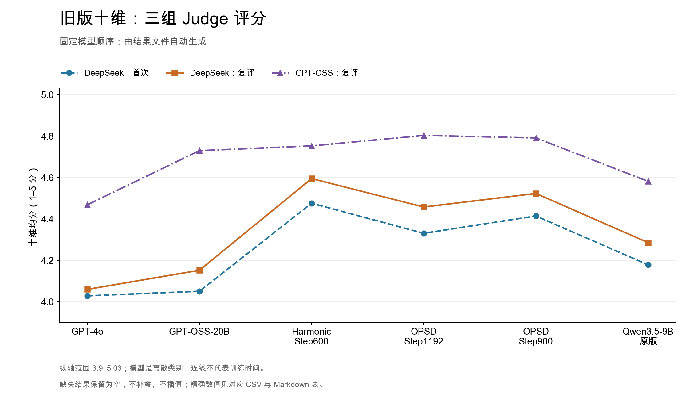
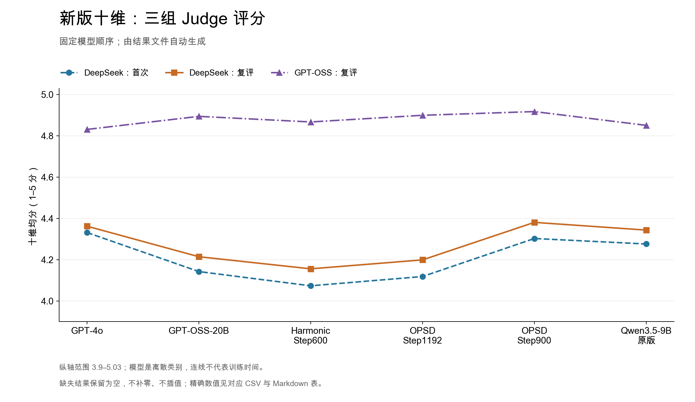
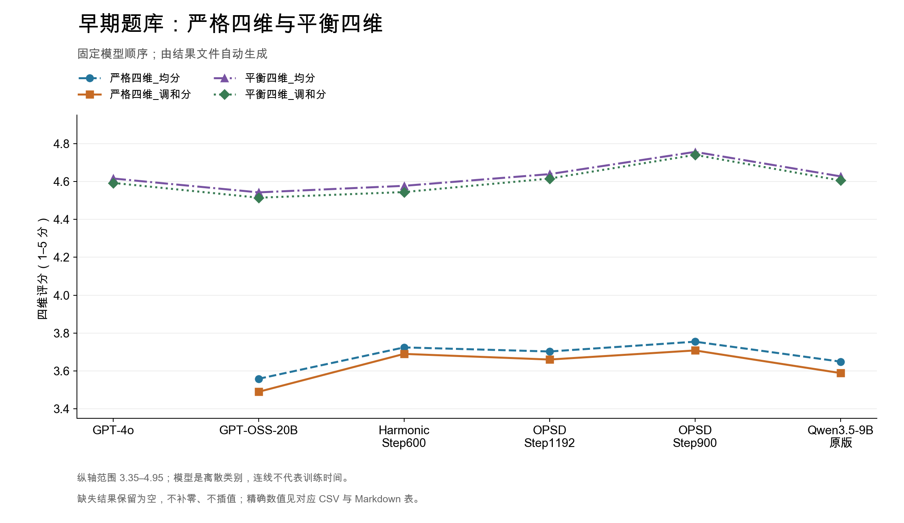
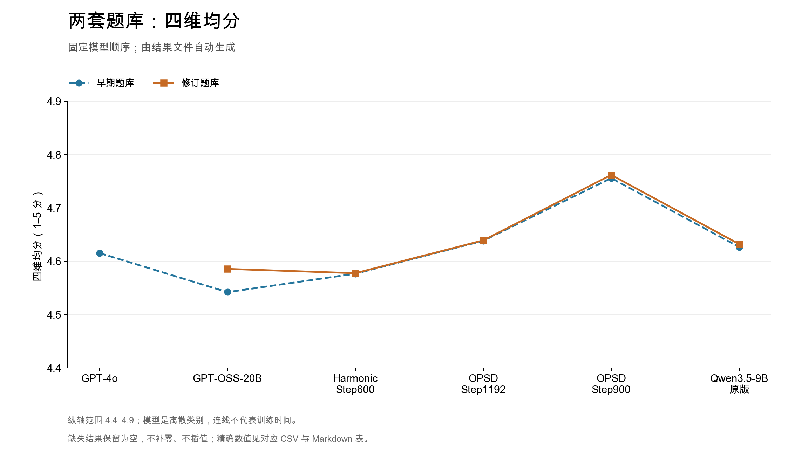
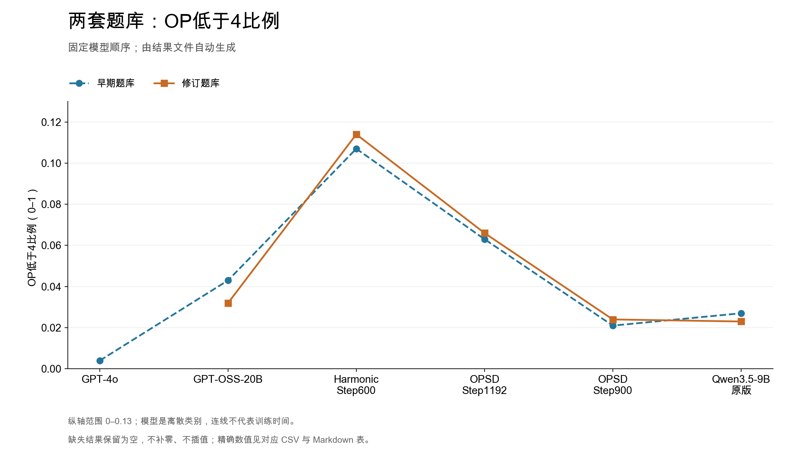
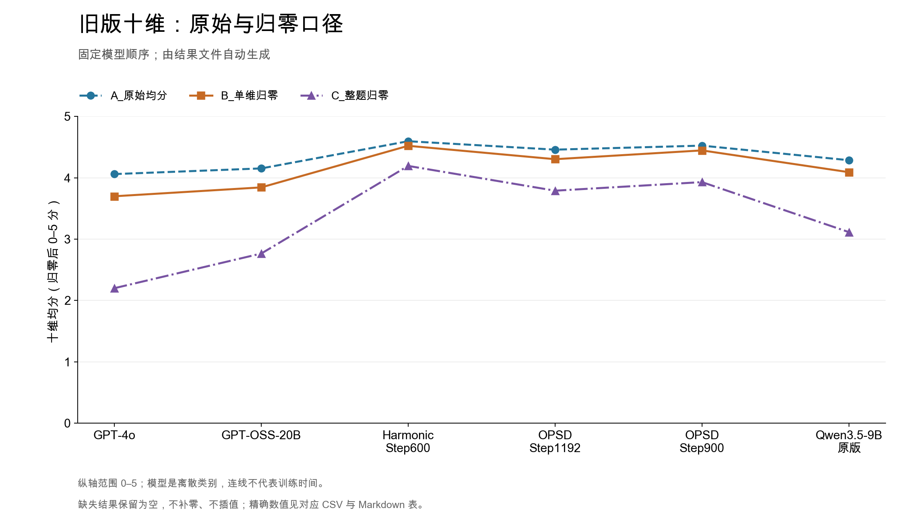
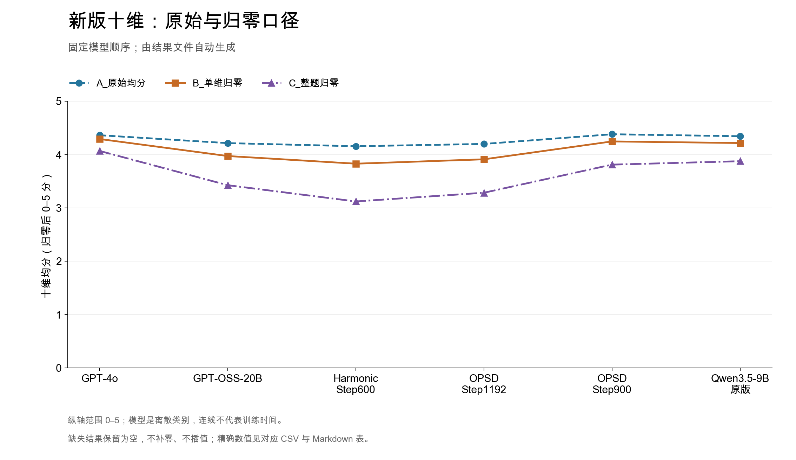
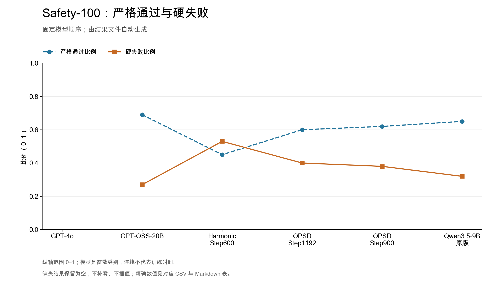
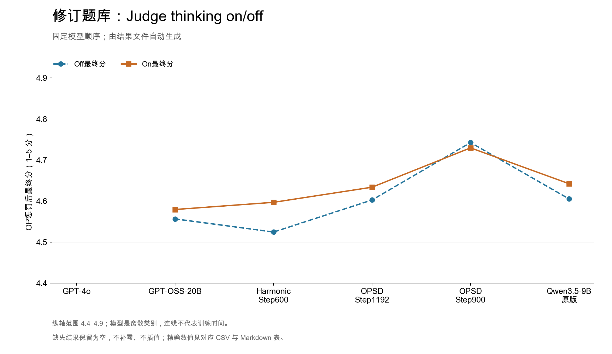

# 模型表现：表格与图

所有数值来自实际评测结果文件，由脚本读取生成。没有采用对话中手填的分数，也没有重新调用模型评分。

## 如何读这些结果

- **题库版本**：早期1000题（六模型）与老师修订后的1000题（五模型）分别报告。修订题库没有GPT-4o结果。
- **评分协议**：严格四维、平衡四维、旧版十维、新版十维是不同协议。“新版十维”不等于“修订题库”。
- **Judge批次**：十维图中的首次DeepSeek、2026-09-18批次DeepSeek复评、GPT-OSS复评分别保留，不合并为一个分数。GPT-OSS对GPT-OSS-20B的评价属于自评。
- **聚合口径**：四维默认逐题计算后平均。归零口径仍保留全部题目作为分母，不只平均通过的题目。没有跨协议或跨题库的“总排名”。
- **模型顺序**：GPT-4o → GPT-OSS-20B → Harmonic Step600 → OPSD Step1192 → OPSD Step900 → Qwen3.5-9B原版。缺失结果留空，不补零。

## 表格索引

| 数据范围 | 表格 | CSV |
| --- | --- | --- |
| 两套题库，DeepSeek平衡四维 | [均分、调和分、OP最终分及bad case比例](tables/balanced4_overview.md) | [下载](tables/balanced4_overview.csv) |
| 两套题库，DeepSeek平衡四维 | [六个直接维度与EI](tables/balanced4_dimensions.md) | [下载](tables/balanced4_dimensions.csv) |
| 两套题库，DeepSeek平衡四维 | [类别切片](tables/balanced4_categories.md) | [下载](tables/balanced4_categories.csv) |
| 早期题库，DeepSeek四维 | [严格四维与平衡四维](tables/strict_vs_balanced4.md) | [下载](tables/strict_vs_balanced4.csv) |
| 早期题库，旧版十维 | [两次DeepSeek与GPT-OSS](tables/old_10d_judges.md) | [下载](tables/old_10d_judges.csv) |
| 早期题库，新版十维 | [两次DeepSeek与GPT-OSS](tables/new_10d_judges.md) | [下载](tables/new_10d_judges.csv) |
| 早期题库，两套十维 | [各Judge分别排名](tables/10d_rankings.md) | [下载](tables/10d_rankings.csv) |
| 早期题库，两套十维 | [三组Judge逐维均分](tables/10d_dimensions.md) | [下载](tables/10d_dimensions.csv) |
| 早期题库，DeepSeek本次复评 | [A/B/C三种口径](tables/10d_abc.md) | [下载](tables/10d_abc.csv) |
| 修订题库，旧版十维 | [原始均分与逐维分数](tables/teacher_old10d.md) | [下载](tables/teacher_old10d.csv) |
| 修订题库，四维与旧版十维 | [整题归零](tables/teacher_all_or_zero.md) | [下载](tables/teacher_all_or_zero.csv) |
| 独立Safety-100 | [严格通过、硬失败与安全分](tables/safety100.md) | [下载](tables/safety100.csv) |
| 独立Safety-100 | [四个安全切片](tables/safety100_slices.md) | [下载](tables/safety100_slices.csv) |
| 修订题库，DeepSeek平衡四维 | [Judge thinking on/off](tables/reasoning_modes.md) | [下载](tables/reasoning_modes.csv) |

十维复评的A/B/C逐维表：[旧版CSV](sources/deepseek_rejudge/old_dimension_summary.csv)、[新版CSV](sources/deepseek_rejudge/new_dimension_summary.csv)。逐题分数与理由：[旧版6000条](sources/deepseek_rejudge/old_10d_detail.csv)、[新版6000条](sources/deepseek_rejudge/new_10d_detail.csv)。

## 图表

图均提供PNG、SVG、PDF；[全部图表及下载入口](figures/README.md)。这里保留此前三张对比图的用途，重新用真实结果文件生成，并补充两套题库、归零口径、安全和Judge推理模式对照。

### 旧版十维：三组Judge



### 新版十维：三组Judge



### 早期题库：严格四维与平衡四维



### 两套题库：平衡四维均分



### 两套题库：OP低于4比例



### 十维复评：原始、单维归零、整题归零





### Safety-100



### Judge thinking on/off



## 统计定义与边界

1. 十维A是原始1–5分平均；B仅将低于4的维度置0；C任一维度低于4就把该题十维全部置0。每组总体分母始终10000，单维分母1000。
2. 平衡四维由Task、Memory、OP及EI组成，EI为Resonation、Expression、Reception的逐题调和分。OP低于4比例只统计低分题，不代表施加了归零。
3. 修订题库四维整题归零检查六个直接字段，不是只检查四个顶层派生维度。既有源汇总同时提供“逐题聚合后平均”和“先维度平均后聚合”；现分列展示，默认使用前者。两种算法本来就会得到不同值。另发现[历史归零脚本](sources/teacher_all_or_zero_source.py)将OP=4的上限设为4.5，而原平衡四维是5：表内保留历史后处理最终分，同时单列按原平衡协议重算的归零最终分。未改动原评分。
4. Safety-100为独立100题，各安全切片25题；不与主1000题合并。Judge thinking对照复用被测模型回答，只改变评分模型的推理模式。
5. 不同题库、rubric、Judge的绝对分差不直接代表模型能力提升。这里为描述性结果，没有把微小分差声明为统计显著。

## 来源与复现

- [来源文件及SHA256](source_manifest.json)：收录实际汇总与本次复评逐题CSV。首次旧十维和平衡四维还直接读取仓库既有 `models/`、`v2/models/`。
- [验收报告](validation.json)：从12000条十维明细重算全部A/B/C总分和逐维均值，检查唯一ID、题目集合、输入回答hash及汇总一致性。其他历史结果按实际源汇总核对；不声称全部历史评分都在本次重新运行过逐题审计。
- [原始DeepSeek复评审计](sources/deepseek_rejudge/audit.json)：保存该批次完整性与成功重试统计。
- [绘图数据](figures/plot_data.json)：由同一份结果文件生成，与CSV表共用数据。

在仓库根目录执行：

```bash
python3 tools/build_performance_reports.py
python3 -m pip install matplotlib
python3 tools/build_performance_reports.py --plots
```

中文图建议安装Arial Unicode MS、Noto Sans CJK SC或SimHei字体。仓库PNG/PDF/SVG已经生成，浏览和下载不需要运行脚本。没有复制机器鉴权信息、API key或运行日志。
